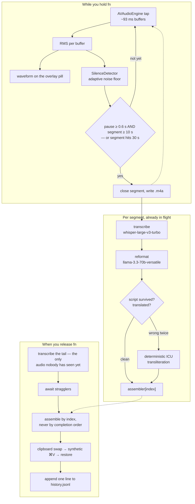

# XFlow

Hold `fn`, speak, release. The text lands in whatever field your cursor is in.

A macOS menu-bar app that replaces the $29/month dictation tools with your own
Groq key, for about ₹3.5 an hour. Speech is transcribed by
`whisper-large-v3-turbo`, then formatted by `llama-3.3-70b-versatile` — which also
transliterates Hindi/Urdu into Latin script, so spoken Hinglish comes out as
"mujhe yeh chahiye" rather than Devanagari.

The wait after you release `fn` is roughly constant no matter how long you spoke,
because everything except the last few seconds was already transcribed while you
were still talking.

Dictations are stored locally in `~/Library/Application Support/XFlow/`, and the
app has a window showing them with search and a few totals. Nothing leaves your
Mac except the audio going to Groq. There is no account and no sync.

**On languages:** single-language speech is excellent. Mixing Hindi and English
*inside one sentence* is not — Groq's Whisper translates the Hindi away, measured
6 of 6 runs. If you code-switch, set the transcription model to
`gpt-4o-mini-transcribe`, which keeps both at about 4.5x the cost. See
[notes/0002](notes/0002-versions.md).

## Requirements

macOS 14 or later, Xcode Command Line Tools, and a Groq API key from
[console.groq.com/keys](https://console.groq.com/keys).

Full Xcode is not required. This project has no `swift test` target for exactly
that reason — see [Development](#development).

## Build

macOS binds every permission grant to an app's code signature. An unsigned build
gets a new signature on every compile, so the OS treats each build as a brand-new
app and makes you re-approve Accessibility every single time. A stable
self-signed certificate fixes that, and costs nothing:

```bash
# One-time, in Keychain Access:
#   Keychain Access > Certificate Assistant > Create a Certificate…
#     Name:            XFlow Dev
#     Identity Type:   Self Signed Root
#     Certificate Type: Code Signing
#
# Or from the terminal:
openssl req -x509 -newkey rsa:2048 -keyout key.pem -out cert.pem -days 3650 -nodes \
  -subj "/CN=XFlow Dev" \
  -addext "basicConstraints=critical,CA:false" \
  -addext "keyUsage=critical,digitalSignature" \
  -addext "extendedKeyUsage=critical,codeSigning"
openssl pkcs12 -export -out dev.p12 -inkey key.pem -in cert.pem -passout pass:xflow \
  -name "XFlow Dev" -certpbe PBE-SHA1-3DES -keypbe PBE-SHA1-3DES -macalg sha1
security import dev.p12 -k ~/Library/Keychains/login.keychain-db -P xflow -T /usr/bin/codesign
security add-trusted-cert -r trustRoot -p codeSign -k ~/Library/Keychains/login.keychain-db cert.pem
rm key.pem cert.pem dev.p12
```

Then:

```bash
./build.sh
open build/XFlow.app
```

`build.sh` warns and falls back to an ad-hoc signature if the identity is
missing, so it always produces a runnable app — you just get the permission
churn. Set `XFLOW_SIGN_IDENTITY` to use a different identity.

Handing the `.app` to someone else needs a paid Apple Developer ID and
notarization, which this project does not do.

## Setup

A wizard opens on first launch and walks through these one at a time. Each
permission screen advances by itself once you grant it.

| Item | Why |
| --- | --- |
| **Microphone** | To record |
| **Accessibility** | To send the paste keystroke to other apps |
| **Input Monitoring** | To see the `fn` key while other apps are focused |
| **Keyboard → "Press 🌐 key to" → Do Nothing** | Otherwise `fn` also opens the emoji picker |

That last one is manual and there is no API for it. It is the step people miss.

Then paste your Groq key (`gsk_…`) from
[console.groq.com/keys](https://console.groq.com/keys). It is stored in your
macOS Keychain and never written to disk or to this repository. **This is the
only key you need** — Groq runs both the transcription and the formatting. An
OpenAI key is optional and only used if you switch to the multilingual model.

Accessibility and Input Monitoring sometimes do not take effect until the app
restarts, so the last screen offers a relaunch. Take it if `fn` does nothing.

Everything is reachable afterwards from **Settings** in the window, including
**Run setup again…** if you need to redo a step.

The **Vocabulary** field is pre-filled with a default set of terms. Edit it to
match your own jargon — names, acronyms, product words. It is the
highest-leverage accuracy knob in the app; see
[Why these exact settings](#why-these-exact-settings).

## Use

Hold `fn`. Speak. Release. Text appears.

The menu bar icon turns red while recording. If the paste is ever blocked, the
transcript is left on your clipboard and you get a notification — you never lose
what you said.

Long dictations are transcribed while you are still speaking, so the wait after
releasing `fn` does not grow with how long you spoke — see
[Chunking](#chunking-and-why-the-wait-stays-flat). Turn it off with **Transcribe
while speaking** in the menu bar to fall back to the single-shot path.

The window (**Open XFlow**, or ⌘0) shows every dictation, grouped by day, with
search and a **Show original** toggle that reveals the unformatted transcript.

## Architecture

Two API calls per segment, and the segments go out while you are still talking.



Three properties fall out of this shape:

- **Nothing is lost on failure.** A segment that fails twice triggers a
  whole-audio resend. A failed cleanup falls back to the raw transcript. A
  blocked paste leaves the text on your clipboard with a notification.
- **Order never depends on timing.** Segment 3 often finishes before segment 1,
  so the assembler keys on index, not arrival.
- **The model's output is verified, not trusted.** Cleanup is checked
  mechanically for surviving script and for translation, with a deterministic
  ICU fallback if both attempts fail.

## Chunking, and why the wait stays flat

The recorder does not wait for you to stop. It watches the RMS it is already
computing for the waveform, and closes a segment at the first real pause:

| Rule | Value | Why |
| --- | --- | --- |
| Pause must last | 0.6 s | Shorter is a gap between words, not a pause |
| Segment must reach | 10 s | Groq bills a 10-second minimum, so cutting earlier pays for silence |
| Force close at | 30 s | A speaker who never pauses still gets segmented |
| Noise floor | adaptive, both directions | Fixed thresholds fail in a noisy room |

The floor moving *slowly downward* is not a detail. When it was allowed to snap
down to any quiet sample, it chased the silences between syllables and pinned
itself near the global minimum, so the threshold landed below a real pause.
Replaying four minutes of speech through both versions:

| | Pauses found | Segments | Force-closed | Tail left at release |
| --- | --- | --- | --- | --- |
| Snap-down floor | 4 | 8 | 6 of 8 | 7.8 s |
| Slow floor | **43** | 16 | 1 | **2.8 s** |

Here is a real 94.5-second dictation from the log. Seven segments were already
transcribed and reformatted before the key came up:

```
speak    ├──────────────────────────────────────────────────────────┤ release
         0s                                                      94.5s

segments ├─ 1 ─┤├─ 2 ─┤├─ 3 ─┤├─ 4 ─┤├─ 5 ─┤├─ 6 ─┤├─ 7 ─┤├─ tail ─┤
               │      │      │      │      │      │      │        │
transcribe     ▼      ▼      ▼      ▼      ▼      ▼      ▼         ▼
             0.42s  0.43s  0.42s  0.48s  0.59s  0.45s   ...      0.45s
               └──────┴──────┴──────┴──────┴──────┴──────┘         │
                   all finished while you were still talking       │
                                                                   ▼
                                                      you wait 1.53 s
```

### Measured, on real dictations

Twelve consecutive dictations, durations from 2.3 s to 94.5 s:

| Spoke for | Segments | You waited |
| --- | --- | --- |
| 2.3 s | 1 | 1.63 s |
| 2.7 s | 1 | 2.10 s |
| 6.1 s | 1 | 3.19 s |
| 6.8 s | 1 | 3.08 s |
| 7.8 s | 1 | 1.61 s |
| 8.2 s | 1 | 2.71 s |
| 47.6 s | 4 | 2.17 s |
| 57.1 s | 5 | 1.61 s |
| 62.8 s | 6 | 2.12 s |
| 71.4 s | 6 | 1.65 s |
| 86.6 s | 5 | 0.94 s |
| 94.5 s | 8 | 1.53 s |

Dictations under 10 seconds averaged **2.4 s**. Dictations over 45 seconds
averaged **1.7 s**. Speaking for forty times longer did not make you wait longer
— the long ones were slightly *faster*, because a short dictation has no
overlap to exploit and pays the full round trip on its only segment.

Without chunking the relationship is linear and brutal: V1 took 1.96 s for a
13-second dictation and **9.56 s** for a two-minute one.

## What it costs

`whisper-large-v3-turbo` is $0.04/hour of audio and `llama-3.3-70b-versatile`
costs fractions of a cent per dictation — roughly **₹3.5/hour**. Groq bills a
10-second minimum per request, which is why segments are never shorter than that.

### The token bill, and what chunking costs you

Chunking buys flat latency. It is not free, and the price is tokens.

The cleanup system prompt — the rules, plus three worked examples that stop the
model answering the speaker — measures **525 tokens**, and it is re-sent with
*every segment*:

| | Cleanup calls | Fixed prompt | Transcript + output | Total |
| --- | --- | --- | --- | --- |
| One call at the end | 1 | 525 | ~660 | **~1,200** |
| Chunked, 8 segments | 8 | 4,200 | ~660 | **~4,900** |

So a 94.5-second dictation costs about **4× the tokens** it would if cleanup ran
once at the end — and buys back roughly 8 seconds of waiting. That is the trade,
stated plainly.

It matters because Groq's free tier is **100,000 tokens/day**, which works out
to roughly 17 long dictations before cleanup starts returning `429`. The failure
is safe — the raw transcript is used and no words are lost — but the formatting
quietly stops. Short dictations are far cheaper per minute of speech, because
they pay the 525-token overhead once instead of eight times.

Settings, all editable from the window or with `defaults write com.aamirhannan.xflow`:
`sttModel`, `cleanupModel`, `vocabulary`, `cleanupEnabled`, `segmentingEnabled`,
`historyEnabled`.

## Four versions, and what each one bought

| | V1 | V2 | V3 | V4 (current) |
| --- | --- | --- | --- | --- |
| Audio sent | once, on release | while speaking | while speaking | while speaking |
| Transcription | OpenAI `gpt-4o-transcribe` | Groq `whisper-large-v3-turbo` | OpenAI `gpt-4o-mini-transcribe` | Groq `whisper-large-v3-turbo` |
| Cleanup | OpenAI `gpt-4o-mini` | Groq `gpt-oss-20b` → `llama-3.3-70b` | Groq `llama-3.3-70b-versatile` | Groq `llama-3.3-70b-versatile` |
| 13 s dictation | 1.96 s | 0.92 s | ~1.48 s | ~0.9 s |
| 126 s dictation | **9.56 s** | ~1.3 s | ~1.5 s | ~1.3 s |
| Cost per hour | ₹32 | ₹3.5 | ₹16 | ₹3.5 |
| API keys needed | 1 | 1 | 2 | **1** |
| Mixed Hindi + English | works | **0 of 6** | 6 of 6 | **0 of 6** |

The V1 → V2 jump is the interesting one, and not for the reason anyone assumed.
Of V1's 9.56 seconds, transcription was 5.45 s and **cleanup was 4.11 s** — 43%
of the wait was the text step nobody had measured. Optimising only
speech-to-text would have left half the latency in place.

V3 → V4 reverses a decision using data the app itself collected: the history
store showed 19 of 20 real dictations were English, so the multilingual model
became a setting rather than a default. Full reasoning in
[notes/0002](notes/0002-versions.md).

Settings, all editable from the menu bar or with `defaults write com.aamirhannan.xflow`:
`sttModel`, `cleanupModel`, `vocabulary`, `cleanupEnabled`, `segmentingEnabled`.

## Why these exact settings

Benchmarked on a real 4-minute Hinglish recording rather than published word
error rates, which are almost entirely English-only:

| | Groq turbo | Groq turbo + vocabulary | OpenAI gpt-4o-transcribe |
| --- | --- | --- | --- |
| "risk owner" | `response और` | ✅ | ✅ |
| SOX | `शॉक्स` | ✅ | `सॉक्स` |
| RBAC | `आरबैक` | ✅ mostly | `आरबैक` |
| 42s clip | 1.00s | **0.71s** | 3.01s |
| 4min clip | 1.55s | — | 11.04s |

Two traps found the hard way:

- **The vocabulary prompt goes on the cleanup call, never on transcription.**
  Two separate harms, found separately. It biases language detection: mixed
  speech survived 3 of 6 runs with it, 6 of 6 without. Worse, the `prompt` field
  is not a vocabulary list to the API — it is *previous context*, so on a
  near-silent clip the model returned the entire list as the transcript and it
  was pasted into a document. Segments close at pauses, so quiet tails are
  routine. Moved to the text stage it cannot affect language detection and still
  does its job: without it, `RBAC` came back as `ARBack` and `SOX` as `Sockets`.
- **Never send `language=en`.** Whisper stops transcribing and starts
  translating and summarising, losing most of the content. Auto-detection is the
  only correct setting, and a check in `XFlowChecks` fails if a `language` field
  ever reappears in the request body.
- `whisper-large-v3` is worse than `turbo` here *and* returned HTTP 500 three
  times on a 983KB file. The cheaper model is the better one for this workload.

## Documentation

| Path | What it holds |
| --- | --- |
| [`CLAUDE.md`](CLAUDE.md) | Working rules: branching, verification, and the hard rules each learned from a real bug |
| [`notes/0001-architecture.md`](notes/0001-architecture.md) | How the app works today |
| [`notes/0002-versions.md`](notes/0002-versions.md) | V1 → V4, what changed and the measured reason for each |
| [`notes/0003-findings.md`](notes/0003-findings.md) | Eight bugs with their numbers, so nobody re-derives them |
| [`notes/0004-phase-2a-decisions.md`](notes/0004-phase-2a-decisions.md) | Why the history store stores what it does |
| [`notes/0005-phase-2bc-decisions.md`](notes/0005-phase-2bc-decisions.md) | Why the window looks the way it does |
| `docs/superpowers/` | Point-in-time specs and plans. Historical, partly superseded. |

If you only read one, read
[`notes/0003-findings.md`](notes/0003-findings.md). Every bug in it was expensive
to find and is cheap to re-introduce.

## Development

```bash
swift build             # type-check everything
swift run XFlowChecks   # assert-based checks over XFlowCore
./build.sh debug        # assemble and sign the .app
```

`XFlowCore` holds everything testable without the OS: the session state machine,
multipart encoding, Groq request/response handling, the vocabulary prompt, the
silence detector, the segment policy, the transcript assembler, and the
clipboard swap. `XFlow` holds the parts only a running app can exercise.

There is no `swift test`. Xcode Command Line Tools ship neither `XCTest` nor
`swift-testing`, so `swift test` cannot run without a full 10GB Xcode install.
`XFlowChecks` is a plain executable of asserts that gives the same red-green
cycle with zero frameworks. Convert it to a real `.testTarget` if you install
Xcode and want one.

Do not run `swift run XFlow`. That produces an unbundled process with no
`Info.plist`, so it has no bundle identifier, no microphone usage string, and no
stable signature. Always launch `build/XFlow.app`.

Timings and segment boundaries are logged to the unified log:

```bash
/usr/bin/log show --last 20m --predicate 'subsystem == "com.aamirhannan.xflow"' | grep -E "200 in|segment"
```

Use the absolute `/usr/bin/log`. A bare `log` is shadowed by a shell function in
some profiles, and you get a confusing "no matching processes" instead of the
log.

### Manual smoke checklist

The OS-level behaviour cannot be unit tested. Run this before any release:

- [ ] Dictate into Chrome's address bar — text appears
- [ ] Dictate into VS Code — text appears
- [ ] Dictate a Hinglish sentence — output is Latin script, not Devanagari
- [ ] Say RBAC, SOX and "risk owner" — all three come back correctly spelled
- [ ] Focus a password field and hold `fn` — pill refuses, nothing is recorded
- [ ] Turn Wi-Fi off and dictate — error on the pill, no crash, no stuck state
- [ ] Revoke Accessibility and dictate — notification says the text is on the clipboard
- [ ] Tap `fn` briefly — nothing happens and no API call is made
- [ ] Hold `fn` for over two minutes — recording auto-stops and transcribes
- [ ] Paste into the API key field with ⌘V — works (an accessory app needs an explicit Edit menu for this)
- [ ] Dictate 3 minutes with pauses — no word lost or duplicated at a segment boundary
- [ ] A 150s dictation feels no slower to finish than a 20s one
- [ ] Speak 40s with no pause — force-close still produces complete text
- [ ] Drop the network mid-dictation — the whole-audio fallback recovers it
- [ ] Turn off "Transcribe while speaking" — single-shot still works

## Known limits

- Clipboard restore is plain text only: copy an image, dictate, and the image is
  gone from your clipboard.
- App Sandbox is off by necessity — a sandboxed app cannot paste into other
  apps — so this can never ship on the Mac App Store.
- The `fn` key is not configurable yet.

## License

MIT
